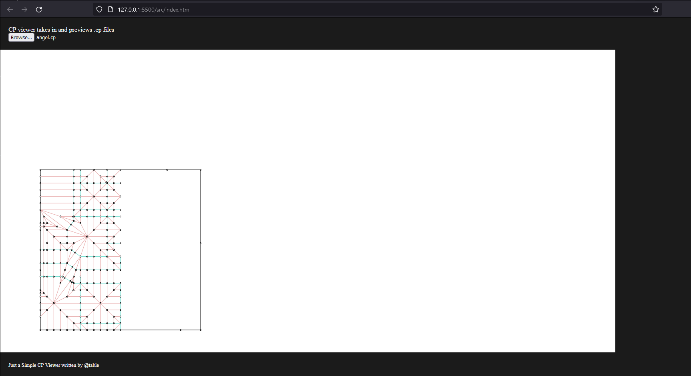

# CP Viewer
---
## The Goal

Generally, most people will view crease pattern files on their desktop computer. However, whenever we want to appreciate/view/help other people's cp that may be distributed (by the authors themselves), we may not be at our desktop at times. Therefore, I have decided to create this program to do just that!

## Description

This web application is created with vanilla javascript + HTML + CSS. Feel free to try this program out at https://cpviewer.netlify.app with an example!    

Additionally, there is no intention to make this editable therefore this is only for "read-only" `.cp` file. Of course, there are still many bugs that I am hoping to fix in this short run of learning p5.js.

## Previewing .CP file

There are a few programs that creates .cp files. They are files that contains information about the type of lines and the location in the cartesian coordinate system. Programs that can create these includes Oriedita, Orihime and Oripa! 

Once you have the files ready we can choose the file and preview it. You can pan and zoom with your mobile devices.

In this application, we can select and view the crease pattern from the CP with optional dark mode selection!



Note that it is also possible to export the images as png image at the moment!


## Hosting Yourself

If you want to play and modify the code or add functionalities, feel free to clone the repository and serve it with any server you like. During development, Visual Studio Code's live server extension is sufficient. Else, using a simple python http server is enough.

```bash
# For python2.x
python -m SimpleHTTPServer 8080

# For python3.x
python3 -m http.server 8080 
```


---

## Intended Features Implemented
- [x] Drawing CP on canvas
- [x] .cp file format parsed within program
- [X] Zooming
- [X] Panning

---

