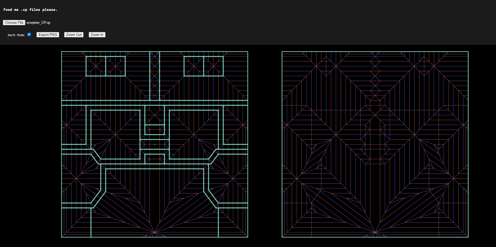

# CP Viewer
---

## Description
This can be hosted and used to to preview selected Crease Pattern files (.cp) files on the web browser. The program is written in pure Javascript with minimal HTML and CSS. You may also try this program out at https://cpviewer.netlify.app with an example!

At the moment, little functionalities are implemented. Also, there is no intention to make this editable therefore this is only for "read-only" `.cp` file. Of course, there are still many bugs that I am hoping to fix in this short run of learning p5.js.

In this application, we can select and view the crease pattern from the CP with optional dark mode selection!

---

## Intended Features Implemented
- [x] Drawing CP on canvas
- [x] .cp file format parsed within program
- [X] Zooming
- [X] Panning

---

